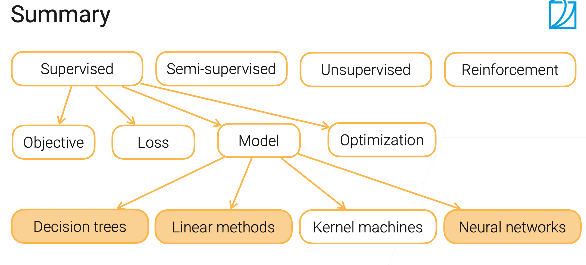

## 3.1 ML Model Overview|机器学习模型简介
### Types of ML Algorithms
1. Supervised
2. Semi- supervised
3. Unsupervised
4. Reinforcement learning 
### Components in Supervised Training
1. Model
2. Loss
3. Objective
4. Optimization
### Types of Supervised Models
1. Decision trees
2. Linear methods
3. Kernel machines
4. Neural Networks
### summary

## 3.2 Decision Trees|决策树
1. Explainable
2. Handle both numerical and categorical features without preprocessing
### Building Decision Trees
1. Use a top-down approach,staring from the root node with the set of all features
2. At each parent node, pick a feature to split the examples
### Limitations of decision Trees
1. Over-complex trees can overfit the data
2. Sensitive to data
3. Not easy to be parallelized in computing
### Random Forest
1. Train multiple decision trees to improve robustness
2. Where is the randomness from：  
    Bagging:randomly sample training examples with replacemen  
    Randomly select a subset of features
### Summary
1. Decision tree: an explainable model for classification/regression
2. Easy to train and tune, widely used in industry
3. Sensitive to data  
    Ensemble can help(more on bagging and boosting latter)

## 3.3 Linear Methods|线性模型
### Linear Regression
A simple house price prediction
### Objective Function
1. Collect n training examples $X = [x_1, x_1, ..., x_n]^T ∈ \mathbb{R}^{n×p}$ with labels $y = [y_1, ..., y_n]^T ∈ \mathbb{R}^n$
2. Objective: minimize the mean square error (MSE)
### Use linear regression for classification problem
1. Regression: continuous output in $\mathbb{R}$
2. Multi-class classification:
3. Waste model capacity on pushing $o_i$ near 0 for off labels
### Softmax Regression
1. One-hot label $\mathbf{y}=[y_1,y_2,...,y_m]where\ y_i =1\ if\ i=y\ otherwise\ 0$
2. $ \hat{\mathbf{y}}=softmax(\mathbf{o})\ where\ \hat{y_i}=\frac{exp(o_i)}{\sum_{k=1}^nexp(o_k)}$
3. Cross-entropy loss between two distributions $\hat{\mathbf{y}}\ and\ \mathbf{y}$
### Mini-batch Stochastic gradient descent (SGD)
1. Train by mini-batch SGD (by various other ways as well)
2. Pros: solve all objectives in this course except for trees
3. Cons: sensitive to hyper-parameters
### Code
1. Train a linear regression model with min-batch SGD
2. Hyperparameters:
    - batch_size
    - learning_rate
    - num_epochs
### Summary
1. Linear methods linearly combine inputs to obtain predictions
2. Linear regression uses MSE as the loss function
3. Softmax regression is used for multiclass classification
   - Turn predictions into probabilities and use cross-entropy as loss
   - Cross entropy loss between two probability distribution
4. Mini-batch SGD can learn both models (and later neural networks as well)