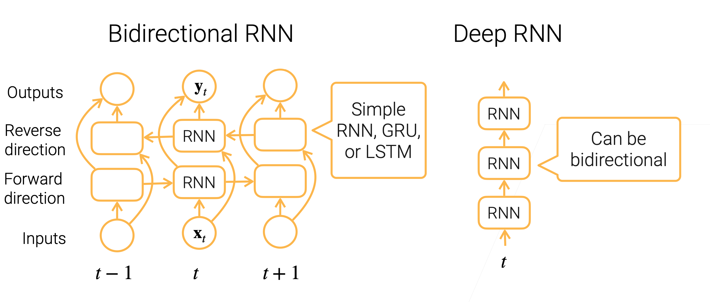
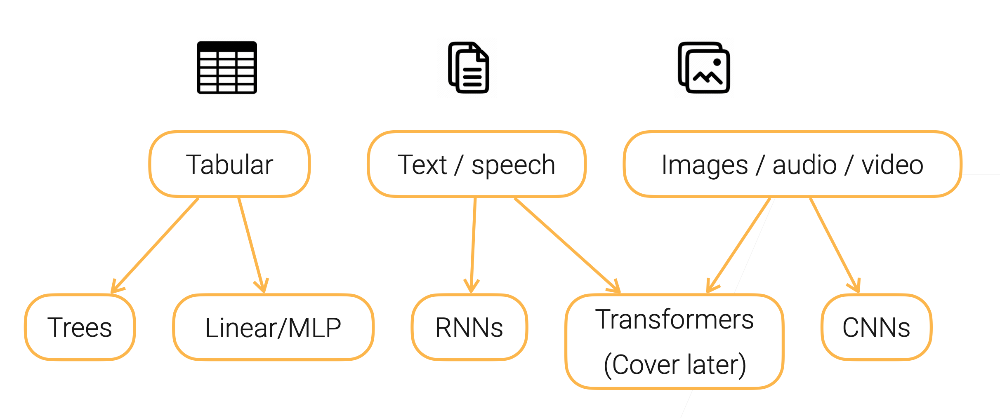

## 3.5 Linear Methods → Multilayer Perceptron (MLP)|多层感知机
### Multilayer Perceptron (MLP)
1. Activation is a elemental-wise non-linear function
2. Stack multiple hidden layers (dense + activation) to get deeper models
3. Hyper-parameters: 
    - #hidden layers, #outputs of each hidden layer
4. Universal approximation theorem
### Code
1. MLP with 1 hidden layer
2. Hyperparameter: num_hiddens

## 3.6 Dense layer → Convolution layer|卷积神经网络
1. Learn ImageNet (300x300 images with 1K classes) by a MLP with a single hidden layer with 10K outputs
    - It leads to 1 billion learnable parameters, that’s too big!
    - Fully connected:an output is a weighted sum over all inputs
2. Recognize objects in images
   1. Translation invariance:similar output no matter where the object is
   2. Locality:pixels are more related to near neighbors
3. Build the prior knowledge into the model structure
    - Achieve same model capacity with less #params
### Convolution layer
1. Locality: an output is computed from k × k input windows
2. Translation invariant: outputs use the same k × k weights (kernel)
3. #model params of a conv layer does not depend on input/output sizes:
    - n×m→k×k
4. A kernel may learn to identify a pattern
### Code
1. Convolution with matrix input and matrix output (single channel)   
### Pooling Layer
1. Convolution is sensitive to location
2. A pooling layer computes mean/max in windows of size k × k
### Convolutional Neural Networks (CNN)
1. Stacking convolution layers to extract features
2. Modern CNNs are deep neural network with various hyper-parameters and layer connections (AlexNet, VGG, Inceptions, ResNet, MobileNet)

## 3.7 Dense layer → Recurrent networks|循环神经网络
1. Language model: predict the next word
2. Use MLP naively doesn’t handle sequence info well
### RNN and Gated RNN
1. Simple RNN: $h_t = \phi(\mathbf{W}_{hh}\mathbf{h}_{t−1} + \mathbf{W}_{hx}\mathbf{x}_t + \mathbf{b}_h)$
2. Gated RNN (LSTM, GRU): finer control of information flow
   1. Forget input:suppress $\mathbf{x}_t$ when computing $\mathbf{h}_t$
   2. Forget past:suppress $\mathbf{h}_{t−1}$ when computing $\mathbf{h}_t$
### Code
Implement Simple RNN
### Bi-RNN and Deep RNN

### Model Selections

