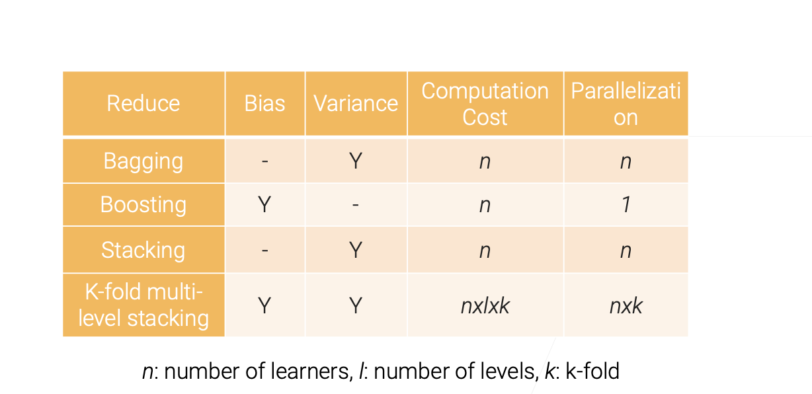

## 5.1 Model Combination

## 5.2 Bagging
### Bagging - Bootstrap AGGregatING
1. Learn n base learners in parallel, combine to reduce model variance
2. Each base learner is trained on a bootstrap sample
3. Combine learners by averaging the outputs (regression) or majority voting (classification)
4. Random forest: bagging with decision trees
### Apply bagging with unstable Learners

## 5.3 Boosting
- Learn n weak learners sequentially, combine to reduce model bias
### Gradient Boosting
### Gradient Boosting Decision Trees (GBDT)
1. Use decision tree as the weak learner
    - Regularize by a small max_depth and randomly sampling features
2. Sequentially constructing trees runs slow
    - Popular libraries use accelerated algorithms, e.g.XGBoost,lightGBM

## 5.4 Stacking
1. Combine multiple base learners to reduce variance
2. Widely used in competitions
3. bagging VS stacking:
    1. Bagging:bootstrap samples to get diversity
    2. Stacking:different types of models extract different features
### Multi-layer Stacking
1. Stacking base learners in multiple levels to reduce bias
2. Upper levels (e.g. L2) are trained on the outputs of the level below (e.g. L1)
### Overfitting in Multi-layer Stacking
1. Train leaners from different levels on different data to alleviate overfitting
2. Repeated k-fold bagging

### Model Combination Summary

